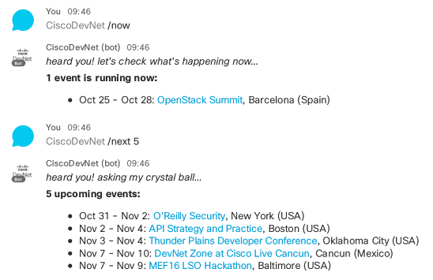

# DevNet Events

Tells about upcoming DevNet events.

Invite _CiscoDevNet@sparkbot.io_ to meet the bot.

## What you can learn here

Go through the [code](bot.js) to learn how to build a Cisco Spark Bot in NodeJS.

Less than 100 lines of code, leverages the [node-sparkbot](https://github.com/CiscoDevNet/node-sparkbot) framework:
- Help command to display available commands
- About command to get meta info about the bot
- Welcome message as the bot is added in a room
- Fallback message if a command is not recognized
- Command with integer argument
- Markdown formatting with lists and hyperlinks
- Uses [node-sparky](https://github.com/nmarus/sparky) library to wrap calls to the Cisco Spark REST API

## What about the Event data 

The bot invokes a [public REST Events API](https://devnet-events-api.herokuapp.com/api/v1/events?limit=100) from which Cisco DevNet events are fetched.

If you need to deploy your own Event API, check the [source code](https://github.com/ObjectIsAdvantag/events-api).

